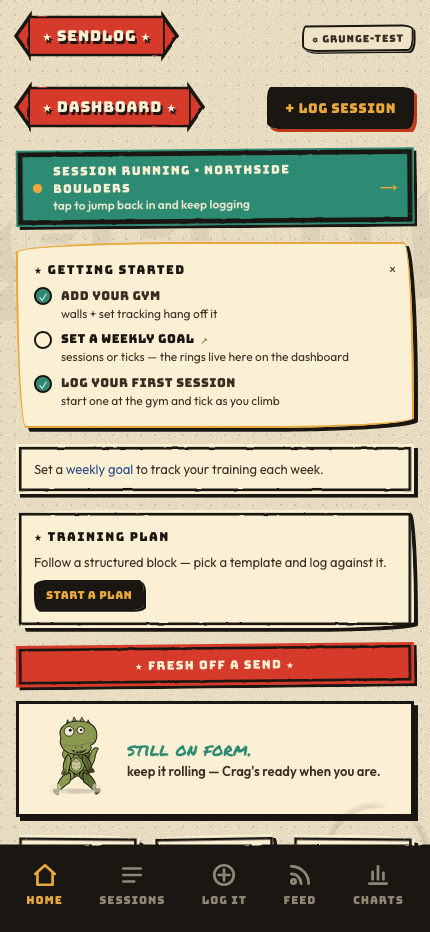
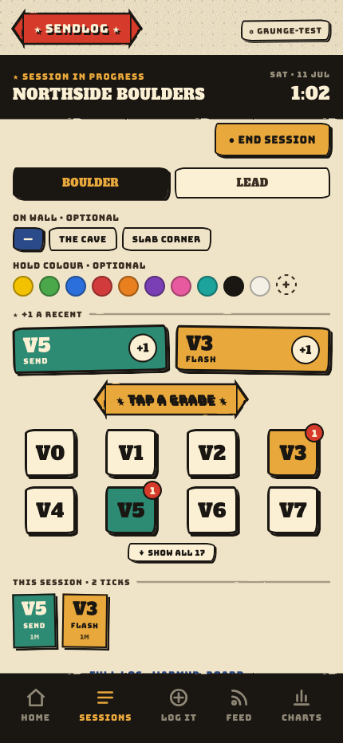
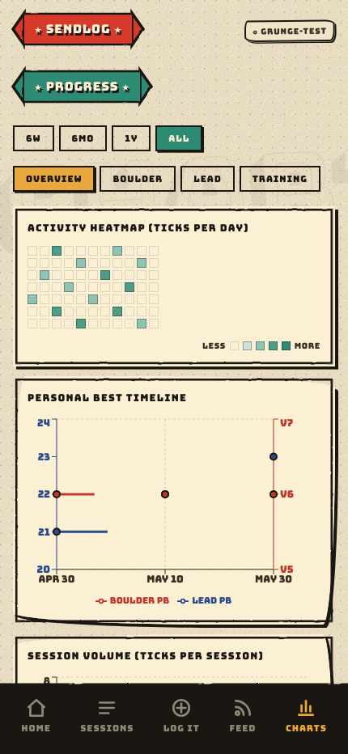
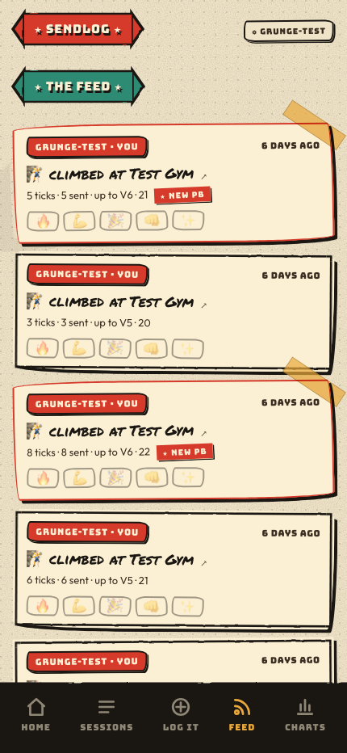

# sendlog

A climbing training log for **you and your friends** — fast in-session logging for
bouldering and lead, deep analytics, gym-set tracking, training plans, and a shared
activity feed. Built to self-host on a homelab as a single Docker container with SQLite.

It's a PWA, so it installs to your phone's home screen and keeps logging even with no
signal at the crag.

> Screenshots live in [`docs/screenshots/`](docs/screenshots).



## Features

### Logging — built for the wall
- **Quick-log** that you fill in *during* a session, one tick at a time — not all at once
- **Boulder** (V-scale) and **lead** (Ewbank / YDS / French) with onsight · flash · redpoint · working · top-rope
- **Fingerboard** (edge, added weight, hang, sets), **strength**, and **warm-ups**
- **Offline-first** — ticks queue locally with no signal and sync when you're back online
- Session timer, rest-between-burns countdown, haptic feedback, one-handed reachability
- Per-session **mood** rating and **"climbed with…"** partner tags

### Projects & beta
- Persistent **projects** (lead & boulder) with topo photos and **drag-to-place high-point pins**
- A **beta-notes** thread per project, and a **canvas hold colour-picker** to isolate a route's holds in a photo

### Analytics
- Send **pyramids** (boulder & lead), progression lines, and a **personal-best timeline**
- Volume, send-rate, falls trend, mood-vs-send-rate, crag breakdown, attempts histogram
- **Contribution heatmap**, volume-vs-intensity scatter, pyramid **drill-downs**, max-grade **projection**
- **Training-load** (acute:chronic workload ratio) to flag overtraining
- A global **date-range filter** drives every chart

### Gym-set tracking
- First-class **gyms** and **walls** (with angle), tagged onto sessions
- **Sets** (reset generations) with per-wall progress — *"22/30 of the current set"*
- **Hold-colour tags** on ticks and **colour circuits** with their own progress — *"9/12 yellows"*

### Training plans
- **Weekly goals** with progress rings on the Dashboard
- A **fingerboard protocol library** (Max Hangs, 7/3 Repeaters, …) that prefills the logger
- **Plan templates** (lead redpoint, lead endurance, max strength, technique, …) that generate a
  schedule; planned sessions tick themselves off as you log real ones
- **Periodisation** phases and an **ACWR-driven deload nudge** delivered by the climbing buddy

### Crag, your climbing buddy
- A tamagotchi-style gecko on the Dashboard that **reacts to how you're climbing** — stoked on a
  PB, cooked after a thrashing, nudging a deload when your load spikes — and **bulks up** as your
  hardest grade climbs. Grungy early-MTV cel art.

### Social — a shared clubhouse
- A **shared activity feed** across everyone on the instance (sessions, PBs, achievements)
- Emoji **reactions** ("props"), partner tags, and project beta notes
- Per-user **opt-out** — hide yourself from the feed any time

### Multi-user & platform
- Accounts (register / login, httpOnly session cookie), a **PIN** fast-unlock with idle auto-lock,
  and strict per-user data isolation
- **Achievements** with unlock badges
- **PWA**: installable, offline shell cache, service worker
- Server-side photo pipeline (HEIC→JPEG, EXIF rotate, resize + thumbnails)
- **JSON export / import** of your whole log
- A couple of easter eggs hiding in there 🦆

## Screenshots

| Quick-log | Progress | The feed |
|---|---|---|
|  |  |  |

## Running locally

### Prerequisites
- Python 3.12+
- Node 22+

### Backend
```bash
cd backend
python3.12 -m venv .venv
source .venv/bin/activate
pip install -r requirements.txt
uvicorn main:app --reload
```

### Frontend
In a second terminal:
```bash
cd frontend
npm install
npm run dev
```

Open [http://localhost:5173](http://localhost:5173). The dev server proxies `/api` to the
backend on port 8000.

### Tests
```bash
cd backend && pytest          # ~240 API tests
cd frontend && npm run build  # type-check + production build
```
CI runs the backend test suite on every PR.

## Deploying with Docker

```bash
docker compose up -d --build
```

The app runs on port `8000`. The SQLite database and uploaded photos are stored in a named
Docker volume (`climbing-data`) so they survive container restarts and rebuilds.

To expose it on your local network, point your router or reverse proxy at port `8000` on the
Docker host.

### Environment variables

| Variable | Default | Description |
|---|---|---|
| `DATABASE_URL` | `sqlite:///./climbing.db` | SQLite path |
| `PHOTOS_DIR` | `./photos` | Directory for uploaded photos |
| `ANDY_PASSWORD` | `changeme` | Password for the seeded first-run admin account |

## Deploying as a Portainer stack (Synology NAS)

The repo ships a prebuilt image to GitHub Container Registry, so the NAS just
pulls it — no building on the Synology.

**1. Publish the image (one time).** Pushing to `main` runs
`.github/workflows/docker-publish.yml`, which builds and pushes
`ghcr.io/andyroo91/sendlog:latest`. After the first successful run, the image
appears under your GitHub profile → Packages.

**2. Make the package pullable.** Easiest: open the `sendlog` package on GitHub
→ Package settings → Change visibility → **Public**. (Or keep it private and add
a GHCR registry in Portainer → Registries, using a GitHub PAT with the
`read:packages` scope.)

**3. Create the host folder for data.** In File Station make e.g.
`/volume1/docker/sendlog/data`. The SQLite DB and photos live here and persist
across redeploys.

**4. Add the stack in Portainer.** Stacks → Add stack → Web editor, paste
[`docker-compose.ghcr.yml`](docker-compose.ghcr.yml), edit the bind-mount host
path to match step 3, then Deploy. (Or use a Repository stack pointing at this
file.)

**5. Updating.** Push to `main` → the Action publishes a new `:latest` → in
Portainer, **Pull and redeploy** the stack.

The app listens on port `8000`; point your UniFi gateway / reverse proxy there.

## Tech stack

- **Backend** — Python, FastAPI, SQLAlchemy 2.0, SQLite (hand-rolled migrations), bcrypt auth
- **Frontend** — React 19, TypeScript, Vite, Recharts, Workbox (PWA)
- **Deployment** — Docker, single container; GHCR image for pull-based redeploys
